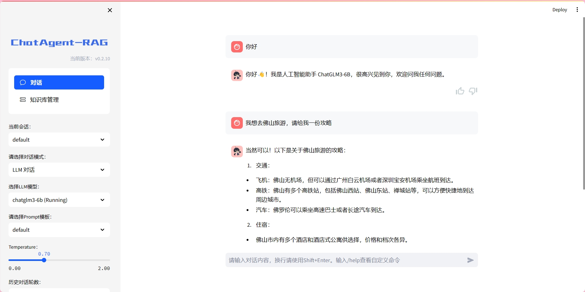
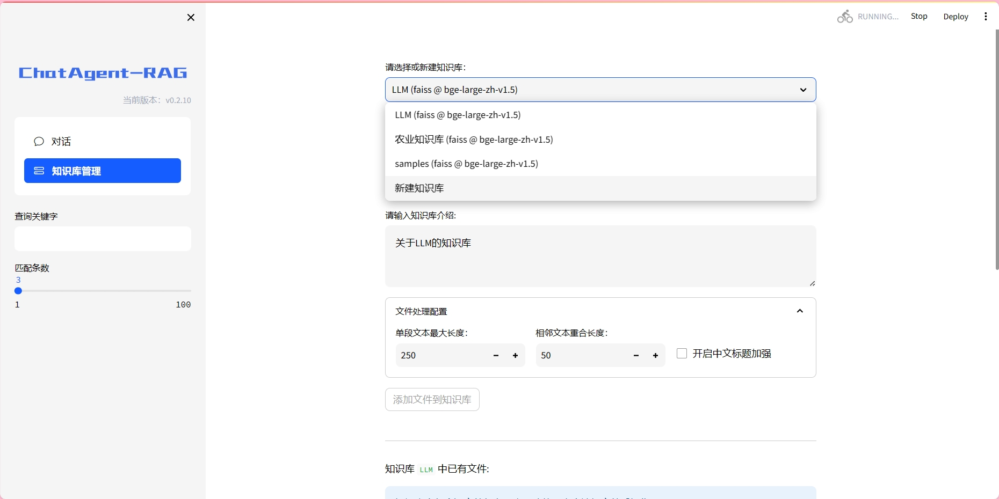
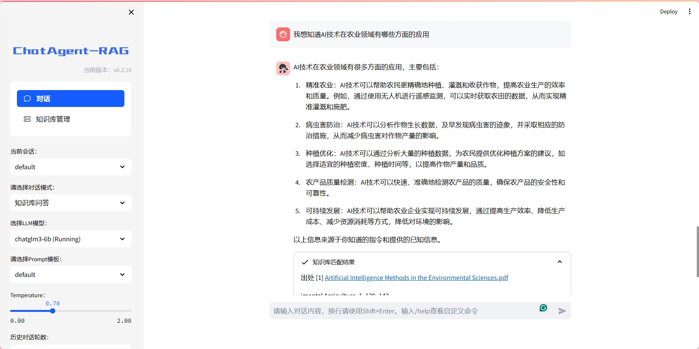

# ChatAgent_RAG
离线部署大模型，构建一个可以上传本地知识库进行RAG问答且可以自行调用工具的Agent。

目前基于langchain建立了一个简易的RAG应用，Agent正在构建中。（参考Langchai-chatglm）

### RAG原理

从文档处理角度来看，实现流程如下：

### 使用方法
初始化数据库(首次使用)
`python init_database.py -r`

一键启动WebUI服务
`python startup.py -a`

### 5. 界面展示

如果正常启动，你将能看到以下界面

Web UI 启动界面示例：

- Web UI LLM对话界面：

- Web UI 知识库管理页面：

- Web UI 知识库对话页面：

### 6.继续改进
目前只实现了普通的RAG流程。
后续工作：
- 对检索过程进行优化
  - 微调嵌入模型
  - 知识库分块优化
  - 提示模板上的优化
- 实现Agent Chat
  - 参考Toolformer让LLM具有调用工具的能力(论文链接：https://arxiv.org/pdf/2302.04761v1.pdf)
  - 参考DeLLMa让LLM具有自行决策的过程(论文链接：https://arxiv.org/pdf/2402.02392.pdf)

